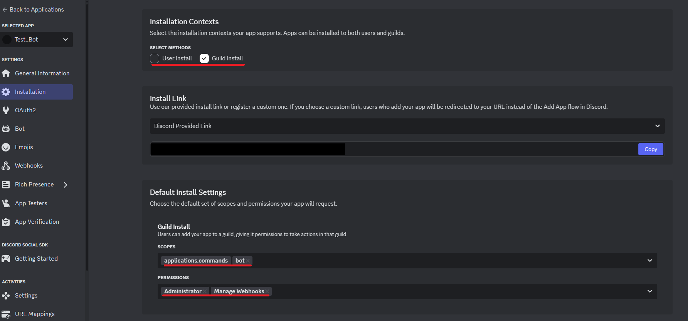

# Discord Announcement Bot 📢

A production-ready Discord bot that automatically publishes messages from announcement channels (NewsChannel type) to all following servers. Built with Python, discord.py, and Docker for easy deployment and scalability.

## Features ✨

- **Automatic Publishing**: Detects messages in announcement channels and publishes them automatically
- **Webhook Message Support**: Detects and publishes webhook messages in announcement channels
- **Rate Limit Handling**: Graceful handling of Discord API rate limits with exponential backoff
- **Error Recovery**: Retry logic for failed publications with comprehensive error logging
- **Permission Management**: Checks and handles missing permissions gracefully
- **Statistics Tracking**: Built-in slash command to view publication statistics
- **Duplicate Prevention**: Prevents duplicate processing of the same message
- **Docker Support**: Fully containerized with Docker and docker-compose
- **Production Ready**: Comprehensive logging, health checks, and error handling

## Requirements 📋

### System Requirements
- Python 3.11+
- Docker and Docker Compose (for containerized deployment)
- 512MB RAM (recommended for Docker deployment)
- 0.5 CPU cores (recommended for Docker deployment)

### Dependencies
- discord.py 2.3.2
- python-dotenv 1.0.0
- aiohttp 3.9.1

### Discord Requirements
- Discord Bot Token
- Bot permissions: Read Messages, Manage Webhooks
- Optional: Privileged Intents (Message Content Intent)

## Quick Start 🚀

### 1. Clone and Setup

```bash
git clone https://github.com/PureCypher/info-publish
cd info-publish
```

### 2. Configure Environment

```bash
# Copy the example environment file
cp .env.example .env

# Edit .env with your Discord bot token
nano .env
```

Add your Discord bot token to the `.env` file:
```env
DISCORD_TOKEN=your_discord_bot_token_here
```

### 3. Deploy with Docker

```bash
# Build and start the bot
docker-compose up -d

# View logs
docker-compose logs -f discord-bot

# Stop the bot
docker-compose down
```

### 4. Alternative: Run Locally

```bash
# Install dependencies
pip install -r requirements.txt

# Run the bot
python bot.py
```

## Discord Bot Setup 🤖

### 1. Create Discord Application

1. Go to [Discord Developer Portal](https://discord.com/developers/applications)
2. Click "New Application" and give it a name
3. Go to the "Bot" section
4. Click "Add Bot"
5. Copy the bot token and add it to your `.env` file

### 2. Configure Bot Permissions

The bot needs these permissions:
- **Read Messages** - To detect new messages in announcement channels
- **Manage Webhooks** - To publish messages to announcement channels



- **Adding to server** - To add the bot to the discord server click copy and then paste this into your web browser of choice and follow the prompts. 

Example link:
```
https://discord.com/oauth2/authorize?client_id=8245193701826473051
```

### 3. Enable Required Intents - (Doesn't need it)

In the Discord Developer Portal, under Bot settings, enable:
- **Message Content Intent**
- **Server Members Intent** (optional, for better guild management)

### 4. Invite Bot to Server

Generate an invite link with the required permissions:
```
https://discord.com/api/oauth2/authorize?client_id=YOUR_BOT_CLIENT_ID&permissions=536870912&scope=bot
```

Replace `YOUR_BOT_CLIENT_ID` with your bot's client ID from the Developer Portal.

## Usage 📖

### Automatic Publishing

The bot automatically monitors all announcement channels (NewsChannel type) it has access to. When a new message is posted in these channels, the bot will:

1. **Detect Message Type**: Identifies both regular user messages and webhook messages
2. **Check Permissions**: Verifies it has the required permissions
3. **Prevent Duplicates**: Ensures the same message isn't processed multiple times
4. **Publish Message**: Attempts to publish using `message.publish()`
5. **Handle Failures**: Implements rate limits and retry logic on failure
6. **Log Results**: Records success or failure with detailed information

### Webhook Message Support

The bot now properly detects and publishes webhook messages, which was a common issue in previous versions. Webhook messages are identified by their `webhook_id` and are processed even though they come from bot users.

### Bot Statistics

The bot tracks internal statistics including:
- Messages published in the last 24 hours
- Messages processed (including webhooks) in the last 24 hours
- Failed publications count
- Server and channel information
- Bot uptime
- Recent failure details

These statistics are automatically cleaned up every hour to prevent memory bloat.

## Configuration ⚙️

### Environment Variables

| Variable | Description | Default | Required |
|----------|-------------|---------|----------|
| `DISCORD_TOKEN` | Your Discord bot token | - | ✅ |
| `PRIVILEGED_INTENTS` | Enable privileged intents (true/false) | false | ❌ |
| `LOG_LEVEL` | Logging level (DEBUG, INFO, WARNING, ERROR, CRITICAL) | INFO | ❌ |
| `PYTHONUNBUFFERED` | Python output buffering (Docker) | 1 | ❌ |
| `PYTHONDONTWRITEBYTECODE` | Disable .pyc files (Docker) | 1 | ❌ |
| `MALLOC_TRIM_THRESHOLD_` | Memory optimization (Docker) | 131072 | ❌ |

### Docker Configuration

The `docker-compose.yml` includes:
- **Auto-restart**: Bot restarts automatically on failure (max 5 retries)
- **Resource limits**: 512MB RAM limit, 0.5 CPU cores
- **Log rotation**: Prevents log files from growing too large (50MB max, 5 files)
- **Volume mounting**: Logs are persisted outside the container
- **Health checks**: Monitors bot health and restarts if unhealthy
- **Graceful shutdown**: 30-second grace period for proper cleanup
- **Security**: Runs as non-root user (botuser)
- **Network isolation**: Uses dedicated bridge network

## Monitoring and Logs 📊

### Log Files

- `bot.log` - Main application log with timestamps
- Docker logs via `docker-compose logs discord-bot`

### Log Levels

- **INFO**: Normal operations, successful publications
- **WARNING**: Rate limits, retries
- **ERROR**: Failed publications, permission issues
- **DEBUG**: Detailed debugging information

### Health Monitoring

The bot includes health checks that verify:
- Python process is running
- Required dependencies are available
- Bot can respond to basic operations

## Troubleshooting 🔧

### Common Issues

#### Bot Not Publishing Messages
1. **Check Permissions**: Ensure bot has "Manage Webhooks" permission
2. **Verify Channel Type**: Only NewsChannel types are monitored
3. **Check Message Source**: Webhook messages are now supported and should be detected
4. **Check Logs**: Look for permission errors and webhook detection messages in logs
5. **Test Webhook Detection**: Use the included `test_webhook.py` script to verify webhook message detection

#### Rate Limiting
- The bot handles rate limits automatically with exponential backoff
- Check logs for rate limit warnings
- Consider reducing message frequency if persistent

#### Docker Issues
```bash
# Rebuild container
docker-compose down
docker-compose build --no-cache
docker-compose up -d

# Check container status
docker-compose ps

# View detailed logs
docker-compose logs --tail=100 discord-bot
```

### Debug Mode

Enable debug logging by setting `LOG_LEVEL=DEBUG` in your `.env` file:
```env
LOG_LEVEL=DEBUG
```

### Privileged Intents Issues

If you encounter privileged intents errors:

1. **Enable in Discord Developer Portal**:
   - Go to https://discord.com/developers/applications
   - Select your bot application
   - Go to "Bot" section
   - Enable "Message Content Intent" under "Privileged Gateway Intents"
   - Save changes

2. **Update Environment Variable**:
   ```env
   PRIVILEGED_INTENTS=true
   ```

3. **Alternative: Run without privileged intents**:
   ```env
   PRIVILEGED_INTENTS=false
   ```
   Note: This may limit some functionality but the bot will still work for basic announcement publishing.

## Development 🛠️

### Project Structure

```
info-publish/
├── bot.py              # Main bot application
├── requirements.txt    # Python dependencies
├── Dockerfile         # Container configuration
├── docker-compose.yml # Orchestration configuration
├── .env.example       # Environment template
├── .env.fixed.example # Fixed environment template
├── logs/              # Log files directory
├── bot.log/           # Additional log directory
└── README.md          # This file
```

### Key Components

- **AnnouncementBot**: Main bot class extending discord.py commands.Bot with graceful shutdown handling
- **ConnectionManager**: Manages aiohttp connections to prevent memory leaks
- **GracefulShutdown**: Handles proper cleanup on shutdown signals (SIGTERM, SIGINT)
- **Message Handler**: Detects and processes announcement channel messages (including webhook messages)
- **Retry Logic**: Handles failures with exponential backoff and rate limit management
- **Statistics Tracking**: Tracks publications, failures, and processed messages with automatic cleanup
- **Health Checks**: Comprehensive health monitoring for container orchestration
- **Privileged Intents Support**: Configurable privileged intents with fallback functionality

### Adding Features

The bot is designed to be extensible. Common additions:

1. **Database Integration**: Store statistics in a database
2. **Web Dashboard**: Create a web interface for monitoring
3. **Custom Filters**: Add message filtering before publishing
4. **Webhook Integration**: Send notifications to external services

## Security 🔒

- **Environment Variables**: Sensitive data stored in `.env` file
- **Non-root User**: Docker container runs as non-privileged user
- **Permission Checks**: Bot validates permissions before operations
- **Input Validation**: All user inputs are validated and sanitized

## Performance 📈

- **Async Operations**: All Discord API calls are asynchronous using discord.py
- **Connection Management**: Optimized aiohttp sessions with connection pooling
- **Memory Management**: Automatic cleanup of old statistics (24-hour retention)
- **Resource Limits**: Docker container includes resource constraints (512MB RAM, 0.5 CPU)
- **Graceful Shutdown**: Proper cleanup of connections and tasks on shutdown
- **Rate Limit Handling**: Built-in exponential backoff for Discord API rate limits
- **Duplicate Prevention**: Message deduplication to prevent processing the same message twice

## Testing 🧪

### Running Tests

Currently, the bot includes built-in monitoring and health checks. To test functionality:

```bash
# Test bot connectivity and health
docker-compose exec discord-bot python -c "
import asyncio
import aiohttp
async def test():
    connector = aiohttp.TCPConnector(limit=1)
    session = aiohttp.ClientSession(connector=connector)
    async with session.get('https://discord.com/api/v10/gateway') as resp:
        print(f'Discord API Status: {resp.status}')
    await session.close()
    await connector.close()
asyncio.run(test())
"

# View bot logs for status information
docker-compose logs -f discord-bot
```

### Health Monitoring

The bot includes comprehensive health checks:
- **Docker Health Check**: Verifies Discord API connectivity every 60 seconds
- **Internal Statistics**: Tracks message processing, failures, and uptime
- **Log Monitoring**: Detailed logging with configurable levels
- **Resource Monitoring**: Memory and CPU usage tracking via Docker

## Contributing 🤝

We welcome contributions to improve the Discord Announcement Bot! Here's how to get started:

### Development Setup

1. **Fork and Clone**
   ```bash
   git clone https://github.com/PureCypher/info-publish.git
   cd info-publish
   ```

2. **Set up Development Environment**
   ```bash
   # Create virtual environment
   python -m venv venv
   source venv/bin/activate  # On Windows: venv\Scripts\activate
   
   # Install dependencies
   pip install -r requirements.txt
   ```

3. **Configure Environment**
   ```bash
   cp .env.example .env
   # Edit .env with your test bot token
   ```

### Making Changes

1. Create a feature branch: `git checkout -b feature/your-feature-name`
2. Make your changes following the existing code style
3. Test your changes thoroughly
4. Update documentation if needed
5. Commit your changes: `git commit -m "Add your feature"`
6. Push to your fork: `git push origin feature/your-feature-name`
7. Submit a pull request

### Code Style Guidelines

- Follow PEP 8 for Python code formatting
- Use meaningful variable and function names
- Add docstrings for new functions and classes
- Include error handling and logging
- Maintain backward compatibility when possible

### Pull Request Guidelines

- Provide a clear description of the changes
- Include any relevant issue numbers
- Ensure all existing functionality still works
- Add appropriate logging for new features
- Update the README if adding new configuration options

## License 📄

This project is licensed under the MIT License. You are free to use, modify, and distribute this software in accordance with the license terms.

### Third-Party Dependencies

- **discord.py**: MIT License
- **python-dotenv**: BSD License
- **aiohttp**: Apache License 2.0

## Support 💬

For issues and questions:
1. Check the troubleshooting section
2. Review the logs for error messages
3. Open an issue on GitHub with:
   - Bot logs
   - Steps to reproduce
   - Expected vs actual behavior

---

**Note**: This bot requires announcement channels (NewsChannel type) to function. Regular text channels will not trigger the publishing functionality.